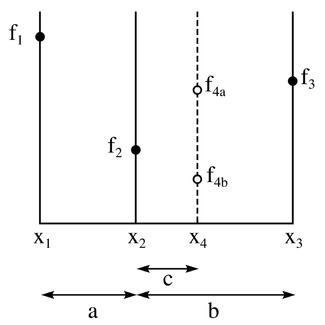
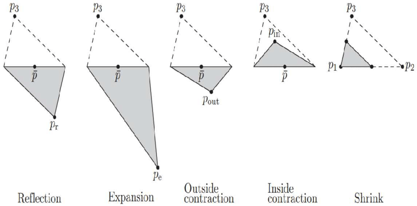
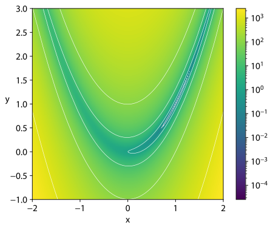

# Optimization

**[Start with introductions and Friday schedule...]**

How do we get a computer to find the max/min of a function?

Remember, you'll be dealing with complicated functions in your research -- so you'll want to be mindful of computation. 

First we'll discuss a popular non-derivative based methods. 


## Grid Search

Divide your domain into a grid $(x_n)$ and evaluate the function at each point. 

Con: Can be very expensive. We should make smarter guesses. 

Pro: You can visualize your function. Can help design smarter methods. 


## Golden Search

Algorithm (finding a minimum)
1. Choose an interval $[x^1,x^3]$ and interior point $x^2$ such that $$f(x^2)<f(x^1), f(x^2)<f(x^3)$$
2. Choose the new triplet that has the interior point as the new minimum.
 


Goal is to do this as fast as possible with the fewest function evaluations. 
* Pick longest interval
* re-use the edge points for the next triplet
* **where should we place $x^2$** to be efficient?
* Spacing proportions should be the same for $(x^1,x^2,x^4)$ and $(x^2,x^4,x^3)$
* interval width should shrink at some constant proportion.
* We want 
  $$\text{for}\,\,\,\frac{c}{a} =\frac{a}{b} \,\,\, \text{and} \,\,\,\, \frac{c}{b-c} = \frac{a}{b} $$
* After some algebraic manipulation, 
  $$(\frac{b}{a})^2 - \frac{b}{a} = 1 \implies \frac{b}{a} = \varphi$$
* $\varphi = \frac{1+\sqrt{5}}{2} = 1.6180339...$ (duh!) 

### Nelder-Mead Optimization

* non-derivative based method
* works in multiple dimensions

**Algorithm**
*(finding a max in three dimensions)*

1. Guess three starting points to form a simplex. 
2. Evaluate and order so that $f(a) > f(b) > f(c)$
3. Reflect: reflect $c$ through $a-b$. Call it $d$
   <!-- * if $f(a) < f(c') < f(b)$ then go to step 1.  -->
4. Expand. If $f(d)>\max\{f(a),f(b)\}$, then keep going with the reflection, in other words, expand.
5. Contract.  if $f(d) < \max\{f(a),f(b)\}$ then contract $d'$ to see if it improves. 
6. Shrink. If the contracted point is the worst still, then shrink the original simplex towards $a$ (without replacing $a$).





#### Example: Banana Function
Define the following functions:

```julia
using Optim  # For optimization routines

# Banana function:
f(x) = -100*(x[2]-x[1]^2)^2-(1-x[1])^2
```

<div align="center">


</div>

Now call Julia's optimization routine for Nelder-Mead:

```julia
using BenchmarkTools  # For timing

@time result = optimize(x -> -f(x), [1.0, 0.0], NelderMead())
x = Optim.minimizer(result)
```

*Note: In Julia, we're using the Optim.jl package which provides similar functionality to MATLAB's optimization toolbox. The interface is slightly different but achieves the same goal.*

## Newton Raphson Method

Now let's consider popular gradient-based methods. Starting with the most "first-principles" approach. 

* Use successive quadratic approximations to the objective.
* Hope is that the max of the approximants converges to the max of the objective.
* This is the EXACT same principle as the Newton root-finding routine (recall linear approximations).
  * Sort of just like applying Newton's for root-finding to the gradient of our objective.

### Iterative procedure:

* Provide guess x⁽⁰⁾
* Maximize the 2nd order Taylor expansion to f about x⁽⁰⁾:
$$f(x) ≈ f(x^0) + f'(x^0)(x-x^0) + \frac{1}{2}(x-x^0)^\top f''(x^0)(x-x^0)$$
* This yields the iterative rule: $x⁽¹⁾ ← x⁽⁰⁾ - [f''(x⁽⁰⁾)]⁻¹f'(x⁽⁰⁾)$

##### Notes:

* If you solve the first order condition then it turns into a root finding problem!*
* Recall the iterative rule for Newton's Method: $x^{(t+1)} ← x^t - [f'(x^t)]⁻¹f(x^t)$
* This is the same iterative rule for root finding, except "one-level" up.

In theory this method will converge to a _local max_ if f is twice continuously differentiable, and if the initial guess is "sufficiently close to a local max, at which $f''$ is negative definite. In practice the Hessian must be well conditioned, i.e., we do not want to divide by zero.

In practice this method is not used because:

* Must compute both first and second derivatives
* No guarantee that next step increases the function value because $f''$ need not satisfy the Second Order Conditions (negative definiteness)
* Also, like most of the procedures we will talk about, we can only find local minimum. (but this is basically unavoidable)

## Quasi-Newton Methods

In practice, we use a strategy similar to Newton-Raphson, but employ an approximation to the Hessian that we force/require to be negative-definite.

This guarantees that the function can be increased in the direction of the Newton Step.

In practice, we will use solvers that approximate the inverse of the Hessian, and do not require any information about the true Hessian.

We will use the following update rule, analogous to Newton-Raphson:

$$d⁽ᵏ⁾ = -B⁽ᵏ⁾f'(x⁽ᵏ⁾)$$

where $B⁽ᵏ⁾$ is the approximation to the inverse of the Hessian.

There are many Q-N methods -- they differ in how they update the inverse Hessian:

**Steepest Ascent:**

Set $B⁽ᵏ⁾ = -I$

**DFP:**

$B ← B + (ddᵀ)/(dᵀu) - (BuuᵀB)/(uᵀBu)$

where $d = x⁽ᵏ⁺¹⁾ - x⁽ᵏ⁾ and u = f'(x⁽ᵏ⁺¹⁾) - f'(x⁽ᵏ⁾)$

**BFGS:**

$B ← B + (1)/(dᵀu)(wdᵀ + dwᵀ - (wᵀu)/(dᵀu)ddᵀ)$

where $w = d - Bu$

## Examples

Compare Q-N method to Nelder-Mead method above.

Banana function (without supplied derivative):

```julia
# Using BFGS without gradient
result = optimize(x -> -f(x), [1.0, 0.0], BFGS())
x_new = Optim.minimizer(result)
```

Banana function (with supplied derivative):

```julia
# Define gradient for banana function
function banana_grad!(g, x)
    g[1] = 400*x[1]*(x[2]-x[1]^2) - 2*(1-x[1])
    g[2] = -200*(x[2]-x[1]^2)
    return -g  # Negative because we're maximizing
end

# Using BFGS with gradient
result = optimize(x -> -f(x), (g, x) -> banana_grad!(g, x), [1.0, 0.0], BFGS())
x_new = Optim.minimizer(result)
```


## Benchmarking Results

I posted a file ```optimization-benchmark.jl``` that compares different methods using two tricky objective functions. 

| Function | Method | Gradient Type | Mean Time (s) | Std Time | Mean Iterations | Convergence Rate | Best Minimum |
|----------|---------|---------------|--------------|-----------|-----------------|-----------------|--------------|
| Rosenbrock | NelderMead | None | 0.0005 | 0.0013 | 70.3 | 1.0 | 5.91e-10 |
| Rosenbrock | BFGS | Analytical | 0.0008 | 0.0023 | 30.3 | 1.0 | 3.08e-31 |
| Rosenbrock | BFGS-FD | Numerical | 0.0114 | 0.0135 | 417.3 | 0.6 | 2.62e-13 |
| Rosenbrock | BFGS-AD | AutoDiff | 0.0057 | 0.0179 | 30.9 | 1.0 | 3.08e-31 |
| Rosenbrock | GradientDescent | Analytical | 0.0021 | 0.0001 | 1000.0 | 0.0 | 1.03e-03 |
| Rosenbrock | ConjugateGradient | Analytical | 0.0009 | 0.0025 | 30.2 | 1.0 | 2.23e-20 |
| Rosenbrock | GoldenSection | None | 0.0104 | 0.0209 | 1000.0 | 0.0 | 4.77e-05 |
| Himmelblau | NelderMead | None | 0.0008 | 0.0022 | 44.3 | 1.0 | 3.68e-11 |
| Himmelblau | BFGS | Analytical | 0.0012 | 0.0038 | 8.7 | 1.0 | 3.16e-30 |
| Himmelblau | BFGS-FD | Numerical | 0.0082 | 0.0142 | 306.0 | 0.7 | 1.50e-16 |
| Himmelblau | BFGS-AD | AutoDiff | 0.0321 | 0.1013 | 8.7 | 1.0 | 3.16e-30 |
| Himmelblau | GradientDescent | Analytical | 0.0001 | 0.0 | 22.7 | 1.0 | 2.98e-20 |
| Himmelblau | ConjugateGradient | Analytical | 0.0008 | 0.0025 | 10.0 | 1.0 | 1.52e-27 |
| Himmelblau | GoldenSection | None | 0.0074 | 0.0235 | 7.9 | 1.0 | 2.06e-18 |


## Special Cases

*(Special case where we know the form of the Hessian.)* 

### Maximum Likelihood


**Basic idea of Maximum Likelihood:** 
Choose a distribution function for some data, $y$, that depends on unknown parameters, $θ$.

The log likelihood function is the sum of the logs of the likelihoods of each of the data observations: $l(θ; y) = Σₙ ln(f(yᵢ;θ))$

**Hessian Approximation**
Define the "score" function as the matrix of derivatives of the $LL$ function evaluated at each observation: $sᵢ(θ;y) = ∂l(θ; yᵢ)/∂θ$

Now consider the $n×k$ (obs x params) score matrix. The expectation of the inner product of the score function is equal to the negative of the expectation of the second derivative of the likelihood function ("information" matrix). This is a positive definite that we can use in place of the Hessian to update the search step .

$d = -[s(θ;y)ᵀs(θ;y)]⁻¹s(θ;y)ᵀ1ₙ$

Plus, the inverse "Hessian" is an estimate for the covariance of $θ$, so we get our standard errors for free!

### Nonlinear Least Squares

Minimize a sum of squared residuals from a generalized residual function. 

# Nonlinear Least Squares (NLLS) Optimization

**Objective Function**
$S(θ) = min_θ \frac{1}{2} ∑_{i=1..N}(yᵢ - f(xᵢ,θ))²$

Where $θ$ is a $k$ dimensional vector.

**Algorithm**
1. Initialize $θ₀$
2. Define Jacobian 
$$
J(θ)= 
\begin{pmatrix}
\frac{∂f_1}{∂\theta_1}... & \frac{∂f_1}{∂\theta_k}\\
... & ... \\
\frac{∂f_N}{∂\theta_1}... & \frac{∂f_N}{∂\theta_k}
\end{pmatrix}
$$
3. The gradient of $S(θ) = \sum_N J(θ)^{\top}f(θ)$.
4. The Hessian is then 
$$
\mathcal{H}(θ) = J(θ)^{\top}J(θ) + \sum_N f_i(θ)\frac{∂^2 f_i}{∂θ∂θ^{⊤}}
$$
5. Approximate the Hessian by dropping the second term (to guarentee positive definite matrix). 
$$
\mathcal{H}(θ) ≈ J(θ)^{\top}J(θ)
$$
6. Search step is then
$$
d = - \big[J(θ)^{\top}J(θ)\big]^{-1}J(θ)^{\top}f(θ)
$$
7.  Repeat until convergence

## Requirements
- Continuous, twice-differentiable f(x,θ)
- Good initial values for convergence
- May need step-size adjustment: $θₜ₊₁ = θₜ - αH⁻¹g$, where $0 < α ≤ 1$ (and g is the gradient $J^\top f$)


## "Global Optimization"

* Simulated Annealing
* Genetic Algorithm
* Pattern Search
* MCMC approaches: Chernozhukov and Hong (2003)

These methods can be very very slow to converge, but are useful in cases where you know your objective function is non-smooth or very ill-behaved.

In Matlab, I have used `simualted annealing` in the `Global Optimization Toolbox`.

In Julia, here are your options:
```julia
using Optim
using BlackBoxOptim
using NLopt
using Evolutionary
```
