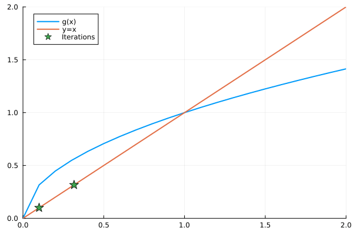

<style>
body {
    font-size: 2.75em;  /* Increases base font size by 20% */
    max-width: 90%;    /* Makes content use more of the page width */
    margin: auto;      /* Centers the content */
}

/* Makes code blocks larger too */
pre code {
    font-size: 1.1em;
}

/* If you want larger headers */
h1 { font-size: 2em; }
h2 { font-size: 1.8em; }
h3 { font-size: 1.6em; }
</style>

# Root Finding and Fixed Points

This notebook explores various methods for finding roots and fixed points of functions, with implementations in Julia.

```julia
using Plots
using Printf
using LinearAlgebra
```

## Overview

There are many examples from economics where we seek to either find the root or the fixed point of non-linear (often many) equations, which cannot be computed analytically.

**Key applications include**
* Many estimation algorithms for equilibrium problems involve a nested structure where there is some root-finding problem in the inner nest: 
  * BLP
  * dynamic discrete choice (Rust, labor models), 
  * production function, 
  * trade models.
* You may want to simulate a model and find equilibria using necessary conditions.
* Models where equilibria may be defined by a simple threshold of a non-linear equation.

## Roots vs Fixed Points

### Roots
A function f from Rⁿ to Rⁿ is given and one must compute a vector x that satisfies: f(x)=0.

### Fixed Points
A function g from Rⁿ to Rⁿ is given and one must compute a vector x that satisfies: x=g(x).

These forms are equivalent:
* f(x) = x - g(x)

***
### Bisection Method

* Based on Intermediate Value Theorem\\[1em]
* If $f$ is continuous and $f(a)$ and $f(b)$ have different signs
* Then there exists at least one root in $[a,b]$\\[1em]
        
        
**Algorithm**
1. Choose two endpoints.
2. Evaluate $f$ at the midpoint.
3. Take the new interval with endpoints with different evaluated signs.
4. Repeat steps 1-3 until convergence. 


**Key Features**
* Simple implementation of classic bisection algorithm
* Guaranteed convergence for continuous functions
* Linear convergence rate: error halves each iteration

**Implementation**

```julia
"""
    bisect(f, a, b; tol=1e-4)

Find root of function f in interval [a,b] using bisection method.
"""
function bisect(f, a, b; tol=1e-4)
    s = sign(f(a))
    x = (a + b) / 2
    d = (b - a) / 2
    xsave = [x]
    
    while d > tol
        d = d / 2
        if s == sign(f(x))
            x = x + d
        else
            x = x - d
        end
        push!(xsave, x)
    end
    
    return x, xsave
end

# Example usage
f(x) = x^3
a, b = -6.0, 12.0
x_root, iterations = bisect(f, a, b)
println("Root found at x = $x_root")

# Visualize the function and iterations
x_plot = range(-4, 4, length=100)
p = plot(x_plot, f.(x_plot), label="f(x) = x³", legend=:topleft)
plot!(p, x_plot, zeros(length(x_plot)), label="y = 0")
scatter!(p, iterations, f.(iterations), label="Iterations")
display(p)
```

<!-- ```tikz
\begin{tikzpicture}
    \draw[->] (-2,0) -- (2,0) node[right] {$x$};
    \draw[->] (0,-2) -- (0,2) node[above] {$y$};
    \draw[blue,domain=-1:1] plot (\x,\x^2);
\end{tikzpicture}
``` -->

***
## Function Iteration


* Start with initial guess $x^0$
* Update using rule: $x^{t+1} \leftarrow g(x^t)$
* Convergence requires:
  * Starting guess close to fixed point  
  * at fixed point: $\|g'(x^*)\| < 1$ 

**Implementation**

```julia
"""
    fixpoint(g, x0; tol=1e-4, max_iter=100)

Find fixed point of function g starting from x0.
"""
function fixpoint(g, x0; tol=1e-4, max_iter=100)
    x = x0
    x_history = [x]
    error = Inf
    iter = 0
    
    while error > tol && iter < max_iter
        x_new = g(x)
        error = abs(x_new - x)
        x = x_new
        push!(x_history, x)
        iter += 1
    end
    
    return x, x_history
end

# Example: Fixed point iteration for g(x) = √x
g(x) = sqrt(x)

# Try from below fixed point
x_fp1, hist1 = fixpoint(g, 0.1)
println("Fixed point from below: $x_fp1")

# Try from above fixed point
x_fp2, hist2 = fixpoint(g, 1.8)
println("Fixed point from above: $x_fp2")

```




***
## Newton's Method

Uses derivative information.

Most common method in practice.

**Idea**
* Linearize function around point. 
* Solve for the root of the line.

First-order Taylor approximation: $f(x)\approx f(x^t) + f'(x^t)(x - x^t) = 0$

which yields the following iteration rule: $x^{t+1}\leftarrow x^t - [f'(x^t)]^{-1}f(x^t)$

What do you notice about this?
* Need to know the derivative!!
  * Sometimes we can write it down. 
  * Sometimes we'll need to use our computer to approximate the derivative. 


**Algorithm**
1. Guess initial point $x_0$
2. Linearize function around $x_0$
3. Find root of linear approximation:
   $$x^{t+1} \leftarrow x^t - [f'(x^t)]^{-1}f(x^t)$$
4. Repeat

*Note:* The multi-variate analog is called "Newton-Raphson." 


**Implementation**

```julia
"""
    newton(f, df, x0; tol=1e-4, max_iter=20)

Find root of function f with derivative df using Newton's method.
"""
function newton(f, f_prime, x_init; tol=1e-8, max_iter=100)
    x = x_init
    x_path = [x]
    
    for i in 1:max_iter
        fx = f(x)
        if abs(fx) < tol
            return x, x_path
        end
        
        df = f_prime(x)
        if abs(df) < eps()
            error("Derivative too close to zero")
        end
        
        x_new = x - fx/df
        push!(x_path, x_new)
        x = x_new
    end
    error("Maximum iterations reached")
end

# Example
f(x) = -12 + 2x^(-3)
f_prime(x) = -6x^(-4)
x, path = newton(f, f_prime, 0.1)
println("Root: ", x)

# Visualize Newton's method
x_plot = range(0.1, 0.8, length=100)
p = plot(x_plot, f.(x_plot), label="f(x)", legend=:topleft)
plot!(p, x_plot, zeros(length(x_plot)), label="y = 0")
scatter!(p, path, f.(path), label="Newton iterations")
display(p)
```

***
## Quasi-newton Methods

* Used when analytical derivatives unavailable
* Approximates the Jacobian
* Two main variants:
  * Secant Method (univariate)
  * Broyden's Method (multivariate)

#### Secent Method

Approximates derivative using finite differences:  
$$ f'(x^t) \approx \frac{f(x^t) - f(x^{t-1})}{x^t - x^{t-1}} $$

Update rule:  
$$ x^{t+1} \leftarrow x^t - \frac{x^t - x^{t-1}}{f(x^t) - f(x^{t-1})}f(x^t) $$

```julia
"""
    secant(f, x0, x1; tol=1e-4, max_iter=20)

Find root of function f using the secant method.
"""
function secant(f, x0, x1; tol=1e-4, max_iter=20)
    x_prev = x0
    x = x1
    x_history = [x_prev, x]
    error = Inf
    iter = 0
    
    while error > tol && iter < max_iter
        x_new = x - f(x) * (x - x_prev)/(f(x) - f(x_prev))
        error = abs(x_new - x)
        x_prev = x
        x = x_new
        push!(x_history, x)
        iter += 1
    end
    
    return x, x_history
end

# Example using secant method
x_root, hist = secant(f, 0.1, 0.2)
println("Root found using secant method: $x_root")

# Visualize secant method
x_plot = range(0.1, 0.8, length=100)
p = plot(x_plot, f.(x_plot), label="f(x)", legend=:topleft)
plot!(p, x_plot, zeros(length(x_plot)), label="y = 0")
scatter!(p, hist, f.(hist), label="Secant iterations")
display(p)
```


#### Broyden's Method

This is a multidimensional version of the Secent method. 

* Generate a sequence of vectors $x^t$ and matrices $A^t$
* These approximate the root and Jacobian of $f$
* Guess $x^0$ and $A^0$.
* $A_0$ is often set the numerical Jacobian at $x^0$

Expanding $f$ around $x$ we have:  
$$f(x) \approx f(x^t) + A^t(x-x^t) = 0$$
which yields the following rule
$$x^{t+1} \leftarrow x^t - (A^t)^{-1}f(x^t)$$

Then the Jacobian is also updated iteratively. 

$$A^{t+1} \leftarrow A^t + [f(x^{t+1}) - f(x^t) - A^td^t]\frac{d^t}{d^td^t}$$
where 
$$d^t = x^{t+1} - x^t$$

(in practice, we update the inverse of the Jacobian to save computation)

*Note:* The sequence $(A^t)$ does not necessarily converge to the true Jacobian. 

* This method will work if you start sufficiently close, and $f$ is well behaved...duh!

* In practice, I have used this method and it has worked very well for problems where the Jacobian diagonally dominant. 


#### Comparing Newton-Raphson and Broyden's Methods

1. **Newton-Raphson Method (multi-variate Newton)**:
   - Computes the exact Jacobian matrix at each iteration
   - Requires analytical derivatives or numerical approximation of derivatives at each step
   - Generally converges quadratically
   - More expensive per iteration but usually needs fewer iterations

2. **Broyden's Method**:
   - Approximates the Jacobian using rank-one updates
   - Doesn't require computing derivatives at each step
   - Converges superlinearly (slower than quadratic)
   - Less expensive per iteration but might need more iterations

Let's solve the same problem with both methods:

```julia
# System of equations
function f!(F, x)
    F[1] = x[1]^2 + x[2]^2 - 1
    F[2] = x[1] - x[2]
end

# Initial guess
x0 = [2.0, 1.0]

# Set up problem
prob = NonlinearProblem(f!, x0)

# Solve using Newton-Raphson
sol_newton = solve(prob, NewtonRaphson(), abstol=1e-8)

# Solve using Broyden
sol_broyden = solve(prob, Broyden(), abstol=1e-8)

println("Newton-Raphson solution: ", sol_newton.u)
println("Newton-Raphson iterations: ", sol_newton.iterations)
println("\nBroyden solution: ", sol_broyden.u)
println("Broyden iterations: ", sol_broyden.iterations)
```

#### When to Use Each Method

**Use Newton-Raphson when:**
- You have analytical derivatives
- High accuracy is needed
- The cost of computing derivatives is low
- You need quadratic convergence

**Use Broyden's Method when:**
- Computing derivatives is expensive or impossible
- Memory usage is a concern
- You can accept superlinear convergence
- The problem is well-conditioned


